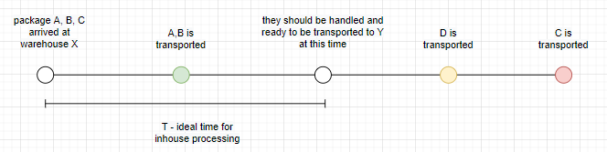
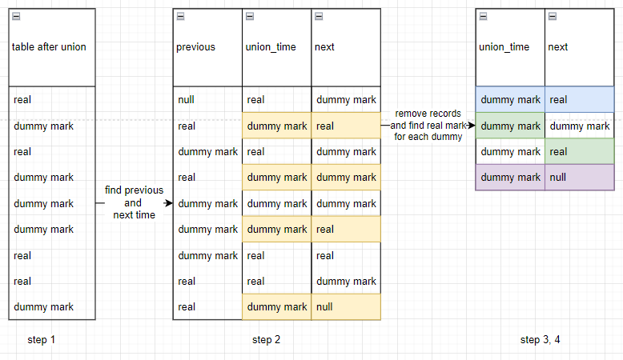

### I/ Overview

- This is part of data preparation for warehouse operation quality monitor dashboard
- Each package in the warehouse is expected to be transported as soon as possible

- The logic is described as above image:
    - A,B,C arrived at X at the same time, and all three should be transported to Y
    - D also arrived at X and should be transported to Y, we don't care when D arrived at X
    - As D is the first transported after T, so it is "the mark" - A, B, C should be transported before or at that mark  
- Based on that logic:
    - A & B is transported on time
    - C is late

### II/ Data input
- `package_order`: id of the package
- `from_point`: id of the warehouse where the package is imported 
- `from_time`: import time
- `to_point`: id of the warehouse where the package did/should arrive
- `to_time`: export time

My data looks like this

|`id`|`package_order`|`from_point`|`from_time`|`to_point`|`to_time`|
|---|---|---|---|---|---|
|1|   A   |U   |timestamp   |V   |timestamp| 
|2|   A   |V   |timestamp   |W   |timestamp| 
|3|   A   |X   |timestamp   |Y   |timestamp| 
|4|   A   |Y   |timestamp   |Z   |null     | 

(`null` if the package is still in the warehouse)

### III/ Data output

- Find "the mark" for each package and check if it is transported on time or late
- Even if the package is not transported (`to_time is null`), it still should have a mark if one package with the same `from_time` and `to_point` is exported
- The mark is null in case
    - The package stays in the warehouse less than T (ideal time for inhouse processing)
    - No packages with the same `from_time` is exported

|`id`|`package_order`|`from_point`|`from_time`|`to_point`|`to_time`|`mark`|
|---|---|---|---|---|---|---|
|1|   A   |U   |timestamp   |V   |timestamp| timestamp|
|2|   A   |V   |timestamp   |W   |timestamp| timestamp|
|3|   A   |X   |timestamp   |Y   |timestamp| timestamp|
|4|   A   |Y   |timestamp   |Z   |null     | timestamp|

### IV/ Data processing

Two way to find the mark

#### 1. Hardcore way - Join and row_number
- Step 1: self join the input table using (from_point, to_point) with time condition
- Step 2: row number to get the first mark
        
        select t.* 
        from (
            select a.*, b.to_time as mark,
                    row_number() over (
                        partition by a.from_point, a.to_point, a.package_order, a.from_time 
                        order by b.to_time
                    ) rn 
            from input_table a
            left join input_table b
            on a.from_point = b.from_point 
                and a.to_point = b.to_point 
                and b.to_time >= a.from_time + interval T hours
        ) t where rn = 1

- This way will generate a huge amount of records, and `row_number()` function will take a lot of time to sort all of that (for 9 million records it generate around 4 billion, and I never know when it's done sorting, as I have to kill the query before it finished)
 #### 2. Better option - Row_number before join
- Step 1: 
    - select distinct from_point, to_point, to_time --> real transported mark
    - select distinct from_point, to_point, from_time + T --> dummy mark 
    - union
- Step 2: find the time before and after each time (and the type (real or dummy) respectively)
- Step 3: select only dummy record, and remove if its previous and next record is also dummy
- Step 4:
    - if next record is real --> that's the mark you find
    - if next record is dummy --> the next next record is the mark
    

- This way the amount of records needs sorting much less than the 1st method (around 14 million records ~ 3,5 minutes query run)
- After this, the join is simple
- SQL file will illustrate how I find the mark for each dummy 
